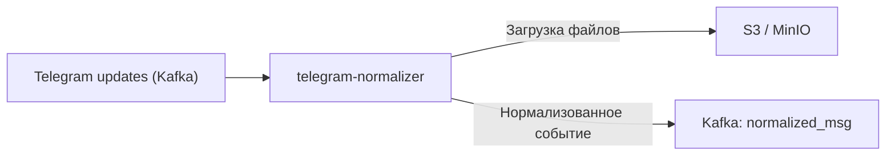
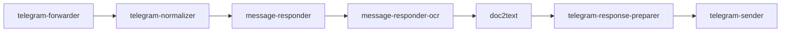

## О приложении

telegram-normalizer получает сырые Telegram‑апдейты из Kafka, превращает их в единый `NormalizedMessage`, скачивает вложения через Telegram Bot API и загружает файлы в S3/MinIO. На выходе сервис публикует сообщение с готовыми S3‑ссылками и минимально необходимыми метаданными.

## Роль приложения в архитектуре проекта

Он идёт сразу после `telegram-forwarder` и обеспечивает остальной пайплайн структурированными событиями:


Сервис отвечает за всю работу с Telegram API (поиск file path, скачивание реального файла), поэтому downstream‑компоненты взаимодействуют только с Kafka и S3.

## Локальный запуск

1. Требования: Go ≥ 1.24, доступ к Kafka и S3 (например, MinIO), валидный Telegram Bot Token.
2. Экспортируйте переменные окружения:
   - Telegram: `TELEGRAM_TOKEN`.
   - Kafka (`KAFKA_`‑префикс): `KAFKA_BOOTSTRAP_SERVERS_VALUE`, `KAFKA_GROUP_ID_TELEGRAM_NORMALIZER`, `KAFKA_TOPIC_NAME_TELEGRAM_UPDATES`, `KAFKA_TOPIC_NAME_NORMALIZED_MSG`, `KAFKA_CLIENT_ID_TELEGRAM_NORMALIZER`, опционально `KAFKA_SASL_USERNAME`/`KAFKA_SASL_PASSWORD`.
   - S3 (`S3_`‑префикс): `S3_ENDPOINT`, `S3_ACCESS_KEY`, `S3_SECRET_KEY`, `S3_BUCKET`, `S3_USE_SSL`.
3. Запустите сервис:
   ```bash
   go run ./cmd/telegram-normalizer
   ```
   или через контейнер `docker build -t telegram-normalizer .`.
4. Для отладки можно записывать апдейты в файл и слать их в Kafka вручную, чтобы убедиться, что объекты попадают в S3 и в `KAFKA_TOPIC_NAME_NORMALIZED_MSG`.
